# Local Agents

## Overview

A **Local Agent** is an autonomous process that runs directly on your machine or private infrastructure and connects to the Agentic Atlas network through a local or exposed router endpoint.  

Local agents are ideal for:


- Rapid development and debugging  
- Offline or on-premises deployments  
- Scenarios where you need full control over your data and compute resources  
- Integrations with local APIs, models, or tools  

Unlike **Cloud Agents**, local agents operate entirely within your environment while still communicating securely with the wider Agentic Atlas ecosystem.

---

## Authentication

Every agent in Agentic Atlas requires a **unique JWT token** to authenticate with the router.  
This ensures that only authorized agents can register, communicate, and execute tasks within the system.

Each agent has **its own token**, which must be defined in its local environment file (`.env`).

### Environment Variable

```bash
AGENT_JWT_TOKEN=<your-agent-token>
```

This token is used automatically when the agent starts and connects to the router.

### How to generate your token

You can generate your agent token directly in the Agentic Atlas platform.

1. Log in to your **AgentOS Platform**.  
2. Go to **Local Agents → Generate Token**.  
3. Copy the generated JWT token.  
4. Paste it into your agent’s `.env` file under the variable `AGENT_JWT_TOKEN`.  

> 💡 **Tip:** You can generate and manage multiple tokens — one per agent instance — to maintain fine-grained access control.

> ⚠️ **Important:** Never share or commit your token to version control. Treat it as a secret.

---

## Development Notes

- **Isolation** → Use a virtual environment or container for each agent to prevent dependency conflicts.  
- **Hot Reloading** → For rapid iteration, use tools like `watchfiles` or `uvicorn --reload` (if applicable).  
- **Logging** → Enable verbose logging for message tracing.  
- **Reconnection Logic** → Handle token expiration and reconnection gracefully.  

---

## Best Practices

| Area | Recommendation |
|------|----------------|
| **Security** | Use a unique `AGENT_JWT_TOKEN` per agent. Never reuse or hardcode tokens. |
| **Performance** | Monitor local resource usage (CPU, memory). |
| **Data Privacy** | Keep sensitive data local; avoid unnecessary uploads to the router. |
| **Debugging** | Use structured logs and unique agent identifiers for traceability. |
| **Deployment** | For long-running local agents, consider Docker for consistency. |

---

## Example Workflow

```mermaid
sequenceDiagram
    participant User
    participant LocalAgent
    participant Router
    participant Backend

    User->>LocalAgent: Run agent.py
    LocalAgent->>Router: Connect (includes AGENT_JWT_TOKEN)
    Router->>Backend: Validate JWT token
    Backend-->>Router: Token valid → authorize connection
    Router-->>LocalAgent: Registration successful
    Backend-->>Router: Dispatch task
    Router-->>LocalAgent: Deliver task
    LocalAgent-->>Router: Return result
    Router-->>Backend: Forward response
```


